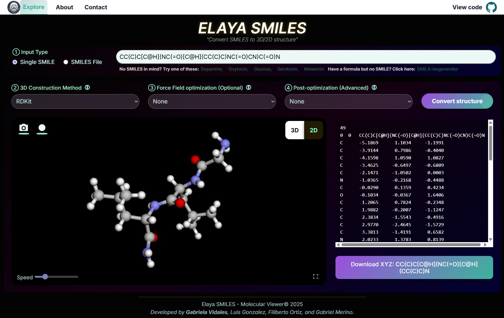
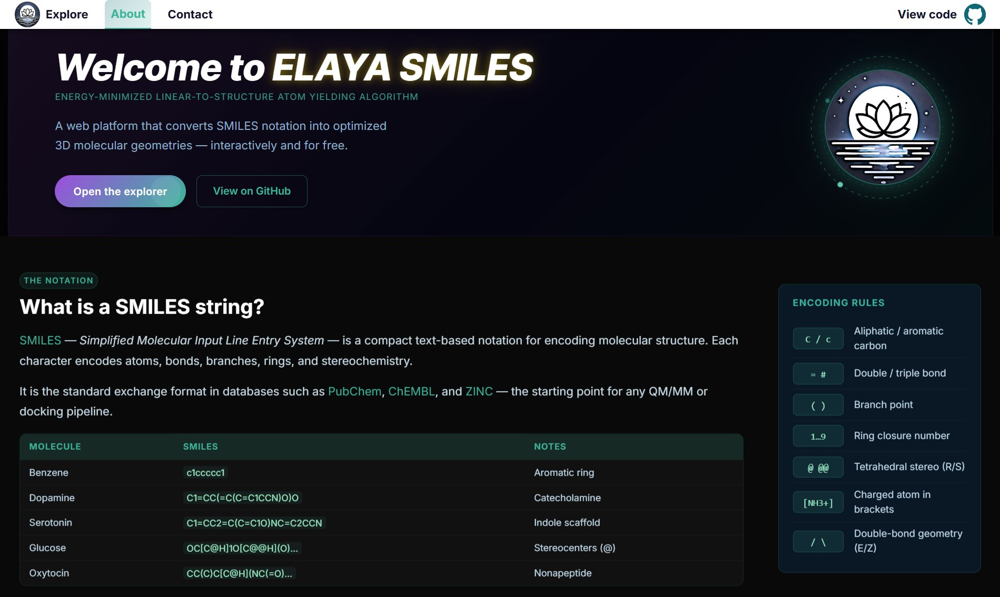
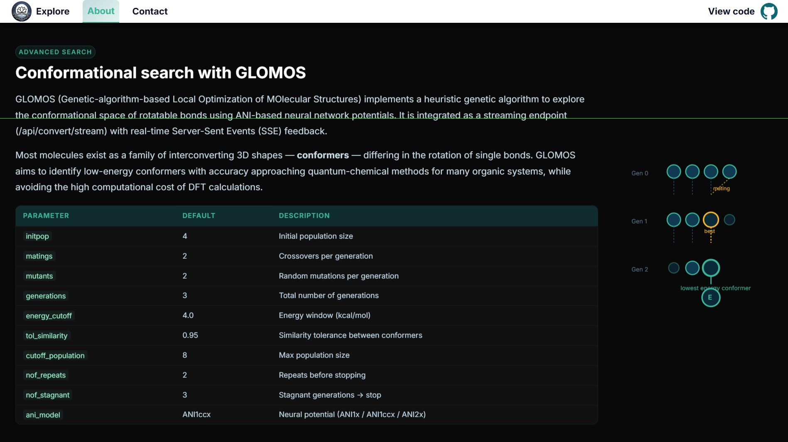

<p align="center">
  
</p>

<p align="center">
  <b>Energy-Minimized Linear-to-Structure Atom Yielding Algorithm</b><br/>
  Convert SMILES strings into optimized 3D molecular structures — interactively and for free.
</p>

<p align="center">
  <a href="https://elaya-smiles.onrender.com/">
    
  </a>
  
  
  
  
</p>

---

<p align="center">
  
  <br/><sub><i>ELAYA SMILES Explorer — Convert any SMILES string into an interactive 3D structure</i></sub>
</p>

---

## What is ELAYA SMILES?

**ELAYA SMILES** is a web-based platform for converting linear molecular representations (SMILES) into optimized three-dimensional structures, enabling visualization and structural analysis within a unified environment.

SMILES (Simplified Molecular Input Line Entry System) provides a compact way to represent molecular structures as text. However, most computational chemistry applications — molecular simulations, docking, property prediction — require accurate 3D geometries. ELAYA bridges that gap by integrating multiple cheminformatics tools to generate reliable 3D conformations, supporting both research and educational workflows.

---

## Features

- **Multi-method SMILES → 3D conversion** — RDKit (ETKDGv3), OpenBabel, and NetworkX topological approximation
- **Interactive 3D molecular viewer** — Rotate, zoom, and inspect structures in the browser
- **Force field optimization** — Geometry refinement via UFF and MMFF94
- **Conformational search with GLOMOS** — Genetic-algorithm-based exploration of conformational space using ANI neural network potentials
- **XYZ export** — Download generated structures in `.xyz` format for downstream calculations
- **SMILES reference guide** — Built-in documentation on SMILES notation, encoding rules, and example molecules

---

## Screenshots

<table>
  <tr>
    <td align="center" width="50%">
      
      <br/><sub><b>SMILES reference guide & encoding rules</b></sub>
    </td>
    <td align="center" width="50%">
      
      <br/><sub><b>GLOMOS — Conformational search with genetic algorithm + ANI potentials</b></sub>
    </td>
  </tr>
</table>

---

## Scientific Highlights

**Distance geometry with torsional knowledge (ETKDGv3)** produces realistic conformations using experimental and knowledge-based constraints. **Force field-based optimization** refines geometries using classical methods. **GLOMOS** (Genetic-algorithm-based Local Optimization of MOlecular Structures) goes further — it implements a heuristic genetic algorithm to explore the conformational space of rotatable bonds using ANI-based neural network potentials, approaching quantum-chemical accuracy while avoiding the high cost of DFT calculations.

### Why 3D geometry matters

Accurate 3D structures are critical for molecular dynamics simulations, structure-based drug design, and quantum-chemical calculations. Molecules exist as ensembles of interconverting conformers due to rotation around single bonds — identifying low-energy conformations is essential for understanding real molecular behavior.

---

## Tech Stack

| Layer | Technologies |
|-------|-------------|
| Backend | Flask, Flask-CORS |
| Cheminformatics | RDKit, OpenBabel |
| Conformational search | GLOMOS (ANI1x / ANI1ccx / ANI2x neural potentials) |
| Visualization | Py3Dmol |
| Frontend | HTML5, CSS3, JavaScript |

---

## Getting Started

```bash
# Clone the repository
git clone https://github.com/GabrielaVidales/elaya-smiles.git
cd elaya-smiles

# Create and activate virtual environment
python -m venv venv
source venv/bin/activate      # Windows: venv\Scripts\activate

# Install dependencies
pip install -r requirements.txt

# Run the development server
flask run
```

The app will be available at `http://localhost:5000`.

---

## Usage

1. Enter a SMILES string in the input field — or pick one of the built-in examples (Dopamine, Oxytocin, Glucose, Serotonin, Melatonin)
2. Select a **3D Construction Method** (RDKit, OpenBabel, or NetworkX)
3. Optionally apply **Force Field optimization** (UFF, MMFF94)
4. Optionally run **GLOMOS conformational search** for advanced post-optimization
5. Explore the interactive 3D viewer or download the `.xyz` file

---

## Development

Developed by **Gabriela Yasmin Vidales Ayala** as part of an initiative to bridge cheminformatics tools with accessible, reproducible workflows for molecular modeling.

Special thanks to **Dr. Filiberto Ortiz Chi** and **Dr. Luis Ortiz** for their scientific guidance and support. Part of the [TheoChemMérida](https://github.com/TheoChemMerida) research group at CINVESTAV Mérida.

---

## License

MIT © Gabriela Yasmin Vidales Ayala · TheoChemMérida · CINVESTAV Mérida
